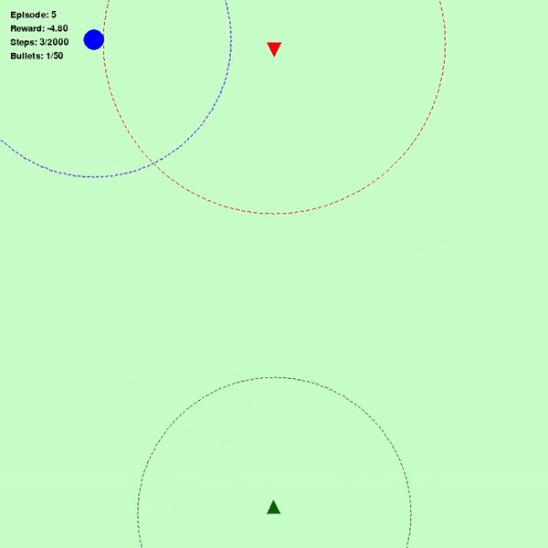
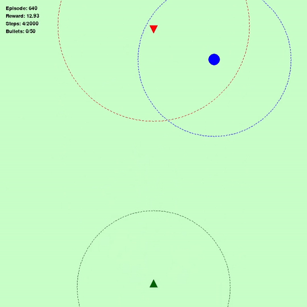
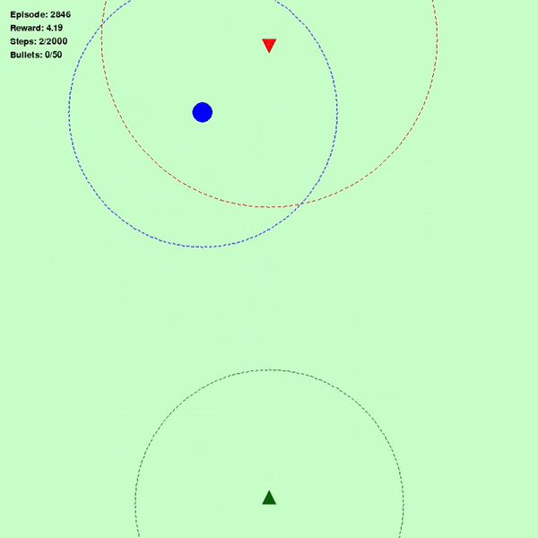

# 基於深度強化學習的自主戰鬥機導航與戰鬥系統

## 1. 引言
這篇論文介紹了一個使用人工智慧（AI）來控制戰鬥機的系統，並且運用了深度強化學習（DRL）來解決多目標的任務。具體來說，這個戰鬥機Agent必須在一個模擬的環境中進行導航，並且達到以下目標：
  
  A. 高效地移動到目標位置。
  
  B. 根據情況選擇是否與敵人交戰或避開敵人。

為了達成這些目標，研究者設計了一個「獎勳函數」，這個函數能夠根據戰鬥機的表現給予它相應的回報。例如，如果戰鬥機成功完成某個任務（例如擊中目標或成功避開敵人），它會獲得獎勳。這樣，AI 就能學習如何在各種情況下做出最好的決策。
此外，為了讓這個系統的決策過程更加透明，研究者提出了一種方法來分析 Agent 的選擇。他們會比較Agent選擇的「實際行動」與其他可能行動的效果（稱為「反事實行動」）。這樣可以讓我們更清楚了解為什麼Agent會選擇某個行動，並進一步解釋它的決策邏輯。

<p align="center">
  
  
  
</p>
圖 1（左）顯示了Agent在訓練初期的表現（綠色三角形代表Agent，紅色三角形代表敵人，藍色圓形代表目標）；圖 2（中）則展示了Agent在經過 640 次訓練後的表現；圖 3（右）顯示了Agent在完全學會環境後的表現。

## 2. 貢獻
本研究的主要貢獻如下：

- **精緻的獎勳函數設計**：設計了一個全面的獎勳函數，平衡了多個相互競爭的目標，如效率和資源管理。該函數綜合了多個因素，驅動有效學習，鼓勵代理優化任務完成與資源使用的平衡。
  
- **自定義模擬環境中的深度強化學習代理實現**：運用穩定基線3（Stable-Baselines3）中的 DQN 算法，訓練了自主戰鬥機Agent，旨在解決具有多重目標的複雜問題——包括導航、擊中指定目標，以及適當地避開或與敵人交戰。該代理在超過 80% 的測試中成功完成任務，展示了在各種情境下的穩健決策能力。
  
- **多目標問題中的可解釋 AI 進展**：該項目展示了深度強化學習能有效解決複雜的多目標問題。從獎勳函數和決策分析中獲得的洞察，有助於加深對 AI 驅動過程中可解釋性提升的理解。
  
- **通過事實與反事實分析增強可解釋性**：過對事實和反事實行動與獎勳的分析，該項目提升了 AI 代理決策過程的透明度。此分析為使用者提供了關於代理為何選擇某些行動而非其他行動的關鍵見解，特別是在需要快速反應的複雜情境下，幫助用戶理解具體決策背後的推理。

## 3. 系統架構
本系統的設計可分為以下幾個模塊：

### 3.1 環境設計
環境是基於 gymnasium 框架構建的，模擬了戰鬥機的運動學、目標追蹤以及敵我交戰的行為。環境的設計包括以下幾個方面：

- **狀態空間**：環境中的每一個狀態包含了戰鬥機的位置、速度、飛行方向、與目標和敵人之間的距離等多維信息。這些數據反映了當前戰鬥機的狀態，幫助Agent做出決策。

- **動作空間**：動作空間包括了6個離散動作：加速、減速、轉向（左、右、上、下）以及射擊。這些動作的設計允許Agent根據當前狀況做出適應性的控制。

- **獎勳設計**：基於Agent的行為來設計獎勳函數，包括：
  - 目標追蹤獎勳：當戰鬥機接近目標時，Agent獲得正向獎勳；
  - 敵人擊中獎勳：成功擊中敵人後給予較高的獎勳；
  - 避免被擊中獎勳：成功躲避敵人攻擊時給予獎勳；
  - 懲罰：在不必要的時候進行加速或是無效的射擊，會使Agent受到懲罰。
    
  


### 3.2 深度強化學習模型
我們使用 Stable-Baselines3 框架中的 DQN 算法來訓練Agent，並設計了如下的網絡結構與訓練參數：

- **網絡結構**：我們使用了三層隱藏層的神經網絡，每層包含 256 個神經元。這個結構能夠有效地捕捉複雜的狀態空間和動作之間的關聯。

- **超參數設置**：
  - 學習率：5e-5，這是經過多次調整後選定的最優學習率；
  - 批量大小：256，每次訓練時從經驗池中選取256個樣本；
  - 緩衝區大小：500000，足以存儲大量的過去經驗；
  - 折扣因子：0.99，這表明未來的回報對當前行動的影響；
  - 探索率：從 1.0 線性衰減到 0.1，促使智能體逐漸從隨機探索轉向依賴學到的策略。

### 3.3 回調函數
為了提升訓練效率並防止過度訓練，我們在訓練過程中引入了兩個重要的回調函數：

- **TensorboardCallback**：用於記錄訓練過程中的關鍵指標（如獎勳、Q 值、探索率等），並通過 TensorBoard 進行可視化，幫助我們深入了解訓練過程。
  
- **EarlyStoppingCallback**：這個回調函數監控獎勳的變化，若在若干步驟內無法提升獎勳，則提前終止訓練，以防止過度擬合並節省計算資源。

## 4. 代碼實現

### 4.1 環境設計
```python
class FighterJetEnv(gym.Env):
    def __init__(self):
        # 初始化環境參數
        self.width = 800
        self.height = 800
        self.max_steps = 2000
        self.bullet_speed = 7
        self.targeting_zone_radius = 200
        self.enemy_observation_radius = 250
        self.action_space = spaces.Discrete(6)
        self.observation_space = spaces.Box(low=-np.inf, high=np.inf, shape=(13,), dtype=np.float32)

    def reset(self):
        # 重置環境
        self.jet_pos = np.array([self.width // 2, self.height - 50], dtype=np.float32)
        self.target_pos = np.array([random.randint(50, self.width-50), random.randint(50, self.height-50)], dtype=np.float32)
        return self._get_obs(), {}

    def step(self, action):
        # 根據動作更新環境狀態
        reward = self._calculate_reward()
        done = self._check_done()
        return self._get_obs(), reward, done, False, {}

    def _get_obs(self):
        # 返回觀測值
        return np.array([self.jet_pos[0], self.jet_pos[1], self.target_pos[0], self.target_pos[1], ...], dtype=np.float32)
```
### 4.1 DQN 訓練配置
```python
model = DQN(
    "MlpPolicy", 
    env, 
    verbose=0,
    tensorboard_log="./fighter_jet_dqn_2/",
    learning_rate=5e-5,
    buffer_size=500000,
    learning_starts=50000,
    batch_size=256,
    tau=0.001,
    gamma=0.99,
    train_freq=1,
    gradient_steps=1,
    target_update_interval=5000,
    exploration_fraction=0.7,
    exploration_initial_eps=1.0,
    exploration_final_eps=0.1,
    max_grad_norm=10,
    policy_kwargs=dict(net_arch=[256, 256, 256]),
    device=device
)
```
### 4.3 回調函數
```python
class EarlyStoppingCallback(BaseCallback):
    def __init__(self, stop_threshold=0.01):
        super().__init__()
        self.stop_threshold = stop_threshold

    def _on_step(self) -> bool:
        if self.model.episode_reward[-1] < self.stop_threshold:
            print("Early stopping triggered!")
            return False
        return True
```
## 5. 結果與分析
### 5.1 訓練過程
在訓練過程中，模型經歷了長達 2,000,000 步的訓練。訓練時間約為 10 小時。為了防止過度訓練並提高訓練效率，我們引入了早停機制（Early Stopping），當訓練過程中的平均獎勳長時間無顯著提高時，該機制會自動終止訓練。這一策略有效地減少了訓練時間，同時避免了過擬合的問題。

訓練過程中的主要指標變化如下：
  - 訓練總步數：2,000,000
  - 訓練時間：約 6 小時
  - 早停機制：在獎勵未改善的情況下自動停止訓練。

### 5.2 可視化結果
以下是訓練過程中關鍵指標的可視化結果：

1. 平均獎勵： 
  - 隨著訓練步數的增加，Agent的平均獎勳逐步上升，這表明Agent學會了如何根據當前的環境狀態進行正確的選擇。最初，Agent主要依賴隨機探索，但隨著訓練進行，逐漸學會了更加高效的戰鬥策略。
    

2. 探索率 (Epsilon)：
  - 在訓練過程中，探索率從初始值 1.0 線性衰減至 0.1，這一過程顯示出Agent在探索過程中的逐步轉變。最初，Agent會進行大量的隨機探索，而隨著訓練進行，它開始更加依賴學到的策略進行決策。這樣的衰減過程幫助Agent更好地平衡探索與利用。
    

3. Q 值分佈：
  - 隨著訓練的進行，Q 值的最大值、最小值以及平均值逐漸穩定在合理範圍內。這表明Agent已經學會了對不同的狀態采取合適的行動，並且該過程的穩定性表明訓練已經達到一定程度的收斂。
    

4. 訓練獎勳隨時間變化：
  - 圖表顯示了訓練過程中每一個訓練步驟的累積獎勳。隨著時間的推移，訓練獎勳的上升顯示出Agent學習到了更加有效的行為策略。初期獎勳波動較大，顯示出隨機探索的影響，而隨著訓練的深入，獎勳穩定上升，表明Agent已經開始採取更多的成功行動。。
    

5. 每回合平均長度隨訓練步數變化：
 - 這個圖顯示了每回合所需的平均步數，這是衡量Agent完成任務所需時間的指標。隨著訓練進行，平均長度逐漸減少，表明Agent學會了更有效率的戰鬥和決策策略。當Agent開始擁有較為穩定的行為時，回合長度逐漸縮短，意味著Agent能更快完成任務。
  


### 5.3 參考論文
[github](https://github.com/swatikar95/Autonomous-Fighter-Jet-Navigation-and-Combat)

[Fighter Jet Navigation and Combat using Deep Reinforcement Learning with Explainable AI](https://arxiv.org/pdf/2502.13373v1)


  
